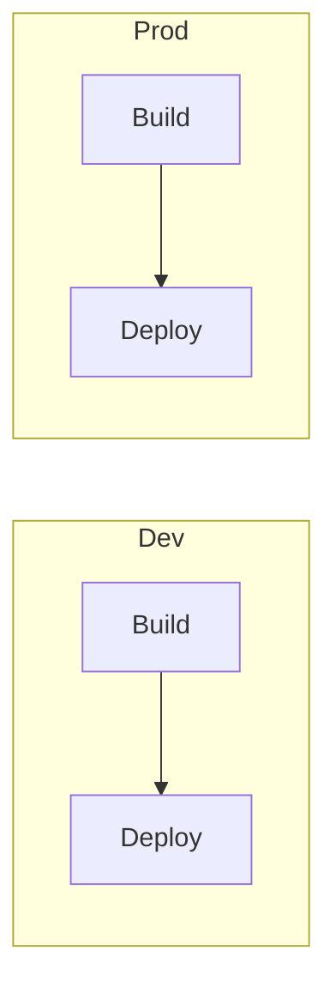
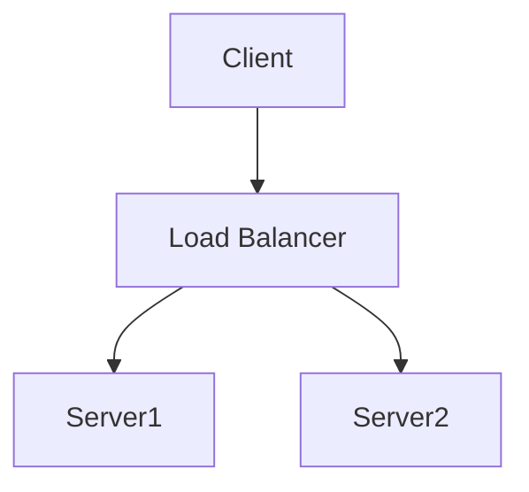

```mermaid
graph LR
  subgraph Dev
    DevBuild[Build] --> DevDeploy[Deploy]
  end
  subgraph Prod
    ProdBuild[Build] --> ProdDeploy[Deploy]
  end
```

```mermaid
graph TD
      A[Client] --> B[Load Balancer]
      B --> C[Server1]
      B --> D[Server2]
```

# Mermaid lessons:
## Styling

# Mermaid hypotheses:
- colours need to be hex? rgb doesn't seem to work
